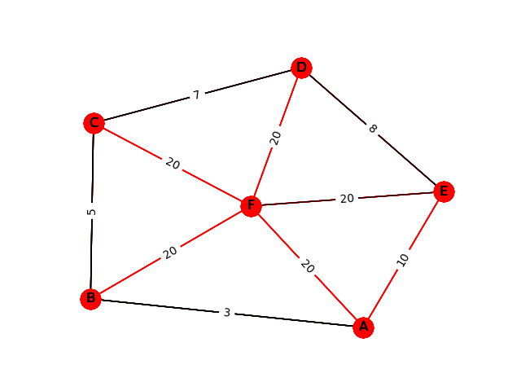

# Prims-Algorithm
## Objective
My objective for this project was to familiarize myself with networkx while also getting some practice implementing a useful algorithm and data structure. 
## Steps Taken
The first steps I took was familiarizing myself with networkx. I first made sure I could create and view a graph before trying to implement Prim's. Then, I made my own priority queue to be used for the algorithm. I did this by implementing a min-heap. Once, I had the queue, I implemented Prim's algorithm to create a minimum weighted spanning tree. With the tree, I was able to color the edges used in Prim's Algorithm and save the graph to a PNG file.
## Results
This was a fairly simple project, but I was able to accomplish what I set out to do. The program loads a graph from a JSON file and saves the graph with the minimum weighted spanning tree highlighted in red.

To run the program, in the command line type "create_min_span_tree.py \<input JSON file\> \<output PNG file\>"

Below are some images of the graphs created by [create_min_span_tree.py](create_min_span_tree.py).

