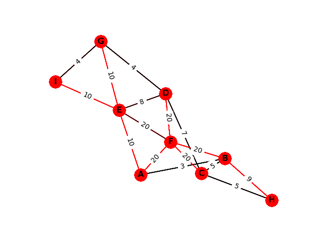
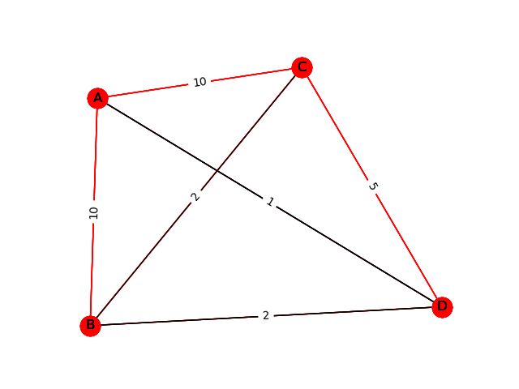

# Prims-Algorithm
## Objective
My objective for this project was to familiarize myself with networkx while also getting some practice implementing a useful algorithm and data structure.
## Steps Taken
The first steps I took was familiarizing myself with networkx. I first made sure I could create and view a graph before trying to implement the algorithm. Then, I made my own priority queue to be used for the algorithm. I did this by implementing a min-heap. Once, I had the queue, I implemented Prim's Algorithm to create a minimum weighted spanning tree. With the tree, I was able to color the edges used in Prim's Algorithm and save the graph to a PNG file. I saved each step of the algorithm, and then used ImageIO to create a gif of all the steps.
## Results
This was a fairly simple project, but I was able to accomplish what I set out to do. The program loads a graph from a JSON file and saves a gif of the steps taken by Prim's Algorithm to add edges to a minimum weight spanning tree.

Command line: 

    prims_algorithm_demo.py <JSON file name> 
                            <output file name> 
                            [highlight color] 
                            [regular color] 
                            [node color]

Below are some images of the graphs created by [prims_algorithm_demo.py](prims_algorithm_demo.py).

